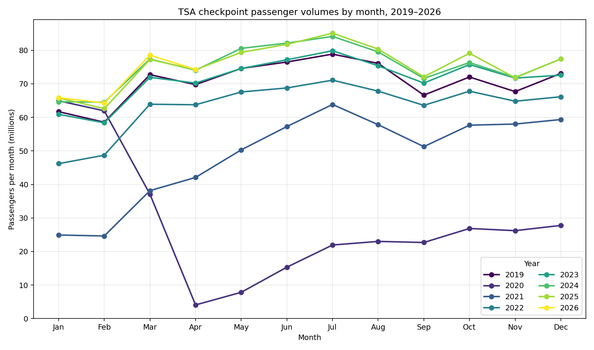

# tsa-data

Scrapes [TSA checkpoint passenger volumes](https://www.tsa.gov/travel/passenger-volumes)
into a local SQLite database, with a one-time backfill mode for 2019–2025
and an `update` mode you can re-run anytime to pick up new days.



## What's in here

| File           | Purpose                                                                 |
| -------------- | ----------------------------------------------------------------------- |
| `tsa.py`       | Scraper + SQLite writer. Subcommands: `update`, `backfill`, `export`.   |
| `chart.py`     | Generates `chart.png` (one line per year, complete months only).        |
| `CLAUDE.md`    | Short notes for future contributors / Claude Code sessions.             |
| `tsa.db`       | SQLite database (gitignored — built by running the script).             |
| `tsa.csv`      | Flat `date,passengers` export, rewritten on every run (gitignored).     |
| `chart.png`    | Pre-rendered monthly chart, committed for quick viewing.                |

Both Python files are [PEP 723](https://peps.python.org/pep-0723/)
single-file scripts — dependencies are declared inline and resolved
automatically by [`uv`](https://docs.astral.sh/uv/). No `pip install`, no
`requirements.txt`, no virtualenv setup.

## Quick start

You need [`uv`](https://docs.astral.sh/uv/getting-started/installation/)
installed. Then:

```bash
# One-time seed of 2019–2025 (≈2,557 rows, takes ~10s):
uv run tsa.py backfill --start 2019 --end 2025

# Fetch the current YTD page (safe to re-run anytime; uses upsert):
uv run tsa.py update

# Re-write tsa.csv from the DB without fetching anything:
uv run tsa.py export

# Render the chart from whatever's in the DB:
uv run chart.py
```

`update` and `backfill` print a per-page summary like:

```
2019: parsed 365 rows  (inserted=365, updated=0, unchanged=0)
```

## Database schema

A single table in `tsa.db`:

```sql
CREATE TABLE passenger_volumes (
    date        TEXT PRIMARY KEY,  -- ISO 'YYYY-MM-DD' (sortable as text)
    passengers  INTEGER NOT NULL,  -- daily checkpoint screenings
    source_url  TEXT NOT NULL,     -- which TSA page this row came from
    fetched_at  TEXT NOT NULL      -- ISO 8601 UTC timestamp of the fetch
);
CREATE INDEX idx_pv_date ON passenger_volumes(date);
```

`update` and `backfill` both **upsert**: rows whose `passengers` value
changed are overwritten (TSA occasionally revises numbers), identical rows
are left alone, and re-runs are safe.

## CSV export

Every `update` and `backfill` run (and the standalone `export` subcommand)
rewrites `tsa.csv` from scratch — the whole table, oldest date first, with a
two-column `date,passengers` layout:

```csv
date,passengers
2019-01-01,2201765
2019-01-02,2424225
...
```

The file is overwritten in full each time (no append), so it always
mirrors the current contents of `tsa.db`. Use `--csv PATH` to write
somewhere other than `./tsa.csv`.

## Accessing the data

### sqlite3 CLI

```bash
sqlite3 tsa.db

# A few starter queries:
sqlite> .headers on
sqlite> .mode column

-- Row count, date range
SELECT COUNT(*), MIN(date), MAX(date) FROM passenger_volumes;

-- Top 10 busiest days
SELECT date, passengers FROM passenger_volumes
ORDER BY passengers DESC LIMIT 10;

-- Monthly totals
SELECT substr(date, 1, 7) AS month, SUM(passengers) AS total
FROM passenger_volumes
GROUP BY month
ORDER BY month;

-- Year-over-year comparison for a given week
SELECT date, passengers FROM passenger_volumes
WHERE strftime('%m-%d', date) BETWEEN '11-22' AND '11-28'
ORDER BY date;
```

### Python

```python
import sqlite3

conn = sqlite3.connect("tsa.db")
for date, n in conn.execute(
    "SELECT date, passengers FROM passenger_volumes "
    "WHERE date >= '2025-01-01' ORDER BY date"
):
    print(date, n)
```

### pandas

```python
import pandas as pd, sqlite3
df = pd.read_sql(
    "SELECT date, passengers FROM passenger_volumes",
    sqlite3.connect("tsa.db"),
    parse_dates=["date"],
    index_col="date",
)
df.resample("ME").sum().plot()
```

## How the scraper works

The TSA pages all share the same simple table layout
(`<th>Date</th><th>Numbers</th>` + `M/D/YYYY` + comma-separated integers),
so the scraper is small:

1. `fetch_page` GETs the URL with a desktop Chrome `User-Agent` header
   (the site returns 403 for default `requests` / `curl` UAs).
2. `parse_table` finds the table whose headers are `Date` + `Numbers` and
   pulls every `<tbody>` row.
3. `upsert` does `INSERT … ON CONFLICT(date) DO UPDATE …` and reports
   inserted / updated / unchanged counts.

Backfill walks `https://www.tsa.gov/travel/passenger-volumes/{YYYY}` for
each year in `[--start, --end]` with a 1-second pause between requests.

## Known gotchas

- **TSA blocks non-browser User-Agents.** The scraper sets a Chrome UA; if
  fetches start returning 403, that string may need refreshing.
- **HTML schema is assumed.** If TSA changes the table structure,
  `parse_table` will raise `ValueError: Could not find passenger volumes
  table on page`.
- **Partial months.** The current year's last month is usually partial —
  `chart.py` filters those out automatically using
  `calendar.monthrange()`.

## Data source & license

Data is published by the [Transportation Security
Administration](https://www.tsa.gov/travel/passenger-volumes) (U.S.
federal government, public domain).

The code in this repo is MIT licensed — see [LICENSE](LICENSE).
